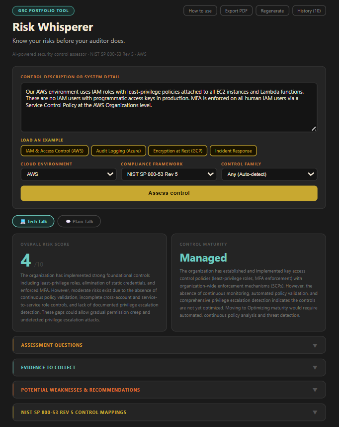
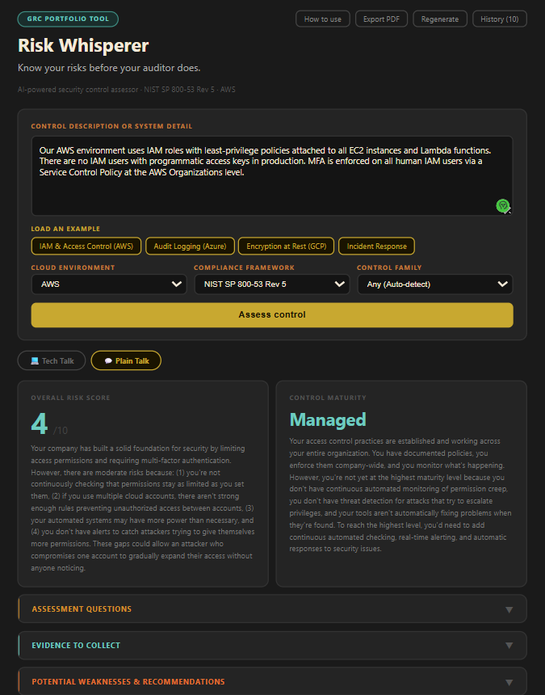

# Risk Whisperer
### AI-Powered Security Control Assessor

Risk Whisperer is a GRC portfolio tool that uses Claude AI to assess security controls against major compliance frameworks. Paste in a control description or system detail and instantly receive assessment questions, evidence requirements, potential weaknesses with remediation recommendations, and framework control mappings: the same outputs a senior GRC analyst would produce manually.

🔗 **Live app:** [riskwhisperer.vercel.app](https://riskwhisperer.vercel.app)

### 💻 Tech Talk View


### 💬 Plain Talk View


---

## What It Does

| Output | What It Means |
|---|---|
| Risk Score (1-10) | Overall risk level of the described control |
| Control Maturity | How mature the control is (Initial → Optimizing) |
| Assessment Questions | Interview questions an auditor would ask |
| Evidence to Collect | Artifacts and screenshots needed for an audit package |
| Weaknesses & Recommendations | Gaps identified with specific remediation steps |
| Control Mappings | 1 to 6 official controls that apply, each with a rationale, checked by a second model |

> Risk Whisperer targets **Stage 2 of the audit lifecycle (Control Assessment)**, automating the outputs that feed directly into evidence collection and findings documentation.

---

## How It Works: Two Models

| Step | Model | Endpoint | What it does |
|---|---|---|---|
| Assessment | Claude Haiku 4.5 (6000 max tokens) | `/api/assess` | Produces the full assessment as JSON, including 1 to 6 `controlMappings` |
| Judge | Claude Opus 5 (4000 max tokens, medium effort) | `/api/judge` | Checks each mapped control against the official AICPA 2017 Trust Services Criteria text and flags weak fits |
| Plain Talk | Claude Haiku 4.5 (6000 max tokens) | `/api/plain` | Rewrites the findings in plain business language, on demand |

**Strict inclusion rule.** The assessment prompt tells the model to map a control only when the input directly and specifically describes something that control governs. A control that is merely related to the topic, or that would apply only because something is missing, is left out. Every rationale must cite words or facts from the input.

**The judge.** After the assessment, the app sends the mapped controls to `/api/judge`. The judge is grounded in the official AICPA 2017 Trust Services Criteria text for all 61 criteria (CC1.1 through P8.1). For each control it writes a rationale that stays within what the criterion actually covers and decides whether the control is a good fit. For SOC 2, every mapped control is judged; for other frameworks, only controls that have an official SOC 2 definition are judged. If the judge call fails, the assessment is shown with its original rationales.

**Flag, never delete.** A control the judge considers a weak fit stays in the list with a ⚠ Weak fit note explaining what the criterion covers that the input does not describe. Nothing is silently removed, so the reviewer makes the final call.

**Verified vs AI-generated labels.** For SOC 2, each mapping shows either "Control name verified · explanation AI-generated" (the name comes from the app's table checked against the AICPA source) or "Control name AI-generated, not yet verified against source". A weak-fit flag on a control with no official definition says it was "judged without a verified definition". Only controls with an official definition may have their rationale rewritten by the judge.

---

## Features

- 💻 **Tech Talk / 💬 Plain Talk toggle**: switch output between GRC technical language and plain language for executives, legal, or finance stakeholders. The translation is generated on demand by a separate call and cached, so toggling back and forth is instant
- ⚖️ **Second-opinion judge**: Opus 5 checks every SOC 2 mapping against the official criteria text and flags weak fits without deleting them
- 🏷 **Verified vs AI-generated labels**: see at a glance which control names were checked against the AICPA source
- 🧾 **SOC 2 Type I and Type II**: Type I focuses on design and point-in-time evidence; Type II focuses on operating effectiveness across an observation period
- 🔒 **Server-side prompts**: prompts, model choice, and the API key all live on the server (see Security below)
- 📝 **POA&M tracking**: assign an owner, target date, and status to each weakness; entries save automatically
- ⏳ **Rotating loading messages**: descriptive status updates while the assessment runs
- 🗂 **Collapsible output cards**: expand only what you need
- 💾 **Persistent history**: the last 10 assessments survive closing the browser tab via localStorage
- 📱 **Installable PWA**: add to your phone or desktop home screen, launches like a native app
- ⚠️ **Smart error handling**: specific messages for bad API keys, rate limits, and network failures
- 📄 **Export PDF**: save the full assessment report
- 📋 **Copy buttons**: copy individual sections to clipboard
- 🧪 **Example presets**: four pre-filled controls to demo the tool instantly
- 🔄 **Regenerate button**: re-run the assessment on current input

---

## Supported Frameworks (15)

- NIST SP 800-53 Rev 5
- NIST CSF 2.0
- FedRAMP Moderate
- FedRAMP High
- CIS Controls v8
- ISO 27001:2022
- SOC 2 Type I
- SOC 2 Type II
- PCI DSS v4.0
- HIPAA Security Rule
- CMMC 2.0
- CISA Zero Trust Maturity Model
- NIST SP 800-171
- NERC CIP
- GDPR

## Supported Cloud Environments

AWS · AWS GovCloud · Azure · Azure Government · GCP · Oracle Cloud (OCI) · Multi-cloud · Hybrid · On-premises

---

## Getting Started

### Prerequisites

- Node.js (v18 or higher)
- An Anthropic API key (get one at [console.anthropic.com](https://console.anthropic.com))
- The [Vercel CLI](https://vercel.com/docs/cli) to run the API functions locally

### Installation

1. **Clone the repository**
```bash
git clone https://github.com/bettybangs/Risk-Whisperer.git
cd Risk-Whisperer
```

2. **Install dependencies**
```bash
npm install
```

3. **Add your API key**
   Create a `.env` file in the root folder:
   ```
   ANTHROPIC_API_KEY=your-api-key-here
   ```

4. **Start the app with the API functions**
```bash
vercel dev
```
   The app opens at `http://localhost:3000`. `npm start` serves only the React frontend, without the `/api` functions.

5. **Run the tests**
```bash
npm test
```

### Deployment (Vercel)

Add `ANTHROPIC_API_KEY` as an environment variable in your Vercel project settings. Do **not** use the `REACT_APP_` prefix, because anything with that prefix is bundled into the browser code.

---

## Architecture

```
Browser ──{ framework, env, family, input }──────► /api/assess ──► Anthropic API (Haiku 4.5)
Browser ──{ framework, input, controlMappings }──► /api/judge  ──► Anthropic API (Opus 5)
Browser ──{ result }─────────────────────────────► /api/plain  ──► Anthropic API (Haiku 4.5)
```

| File | Purpose |
|---|---|
| `api/_prompts.js` | Every system prompt, the SOC 2 reference text, the official AICPA text for all 61 criteria, and the model settings |
| `api/_security.js` | Origin, method, and content-type checks, field validation, and the prompt-injection screen |
| `api/_claude.js` | The single Anthropic API call, with the key and a time limit |
| `api/assess.js`, `api/judge.js`, `api/plain.js` | One endpoint per model call |
| `src/App.js` | The React UI; it sends data only and keeps `SOC2_CONTROLS` for display names |
| `src/options.js` | Dropdown values, tested to match the server's allowed lists |
| `vercel.json` | Gives each API function up to 60 seconds |

Each model call is its own request, so no single function runs Haiku and Opus back to back and each stays within the 60-second function limit set in `vercel.json`.

---

## Security

All prompts are built on the server. The browser never sends a prompt, a model name, or a token limit, and never sees the API key.

- **Server-side prompts and models.** `api/_prompts.js` holds every system prompt and picks the model and `max_tokens` for each call. A request that includes fields such as `system`, `model`, or `max_tokens` is rejected with a 400, not silently ignored.
- **Allowed values only.** `framework`, `env`, and `family` must match the same lists the dropdowns use.
- **Size limits.** `input` is limited to 5,000 characters. `controlMappings` must be an array of at most 6 items, each with exactly `id`, `name`, and `rationale`, and ids may not contain line breaks. The Plain Talk `result` must match the assessment's shape, with limits on every list and string.
- **Prompt-injection screen.** The same patterns the browser checks (for example "ignore previous instructions" or "system prompt") are checked again on the server, since anyone can call the endpoints directly. The browser check stays for instant feedback.
- **POST only.** Other methods get a 405.
- **Origin allowlist.** Only `https://riskwhisperer.vercel.app`, this project's own `*.vercel.app` preview URLs, and `localhost` during development are accepted. The server also requires `Content-Type: application/json`, which blocks cross-site form posts. An origin check is not authentication, so the validation above applies to every request.
- **Clear errors.** Every failure returns `{ "error": { "message": "..." } }`, which the app displays. Upstream calls stop at 55 seconds, before the 60-second function limit, so users see a message instead of a timeout page.

The comment block at the top of `api/_security.js` explains each protection in the code.

---

## Built With

- [React](https://react.dev/): frontend UI
- [Anthropic Claude API](https://anthropic.com): Claude Haiku 4.5 for the assessment and Plain Talk, Claude Opus 5 as the judge
- [Vercel](https://vercel.com): deployment and serverless functions

See [PROMPTS.md](PROMPTS.md) for the prompt design.

---

*Risk Whisperer is a portfolio and educational tool. Outputs should be reviewed by a qualified GRC professional before use in formal audits or compliance programs.*
